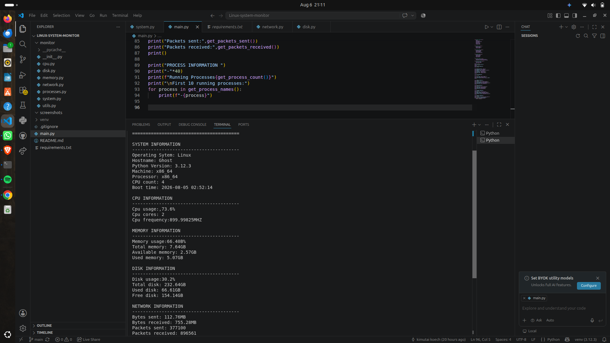

# Linux System Monitor

A modular command-line system monitoring application built with Python using the **psutil** library. The application displays real-time information about the operating system, CPU, memory, disk, network, and running processes.

## Features

* System information
* CPU monitoring
* Memory monitoring
* Disk usage monitoring
* Network statistics
* Running process information
* Modular project structure

## Technologies

* Python 3
* psutil
* Git & GitHub

## Installation

```bash
git clone https://github.com/Kimu-koech/Linux-System-Monitor.git
cd Linux-System-Monitor

python3 -m venv venv
source venv/bin/activate

pip install -r requirements.txt
```

## Usage

Run the application:

```bash
python main.py
```

## Project Structure

```text
Linux-System-Monitor/
├── main.py
├── requirements.txt
├── README.md
├── screenshots/
└── monitor/
    ├── system.py
    ├── cpu.py
    ├── memory.py
    ├── disk.py
    ├── network.py
    ├── processes.py
    ├── utils.py
    └── __init__.py
```

## Screenshots

Add screenshots of the application inside the `screenshots/` folder and reference them here.

```markdown

```

GitHub: https://github.com/Kimu-koech
